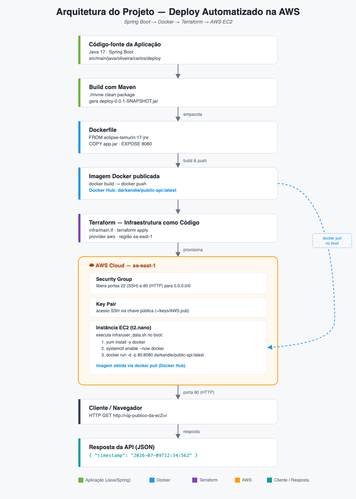

# deploy

API simples em **Spring Boot** que expõe um endpoint que retorna o timestamp atual, empacotada em **Docker** e implantada em uma instância **AWS EC2** provisionada via **Terraform**.

## Arquitetura



O fluxo completo, do código até a API respondendo em produção:

1. **Aplicação** — Spring Boot (Java 17), endpoint `GET /` retorna `{ "timestamp": ... }`.
2. **Build** — `./mvnw clean package` gera o artefato `deploy-0.0.1-SNAPSHOT.jar`.
3. **Containerização** — o [Dockerfile](Dockerfile) empacota o jar sobre `eclipse-temurin:17-jre` e expõe a porta `8080`; a imagem é publicada no Docker Hub (`darkandie/public-api:latest`).
4. **Infraestrutura como código** — [infra/main.tf](infra/main.tf) provisiona na AWS (região `sa-east-1`):
   - um Security Group liberando as portas `22` (SSH) e `80` (HTTP);
   - um Key Pair para acesso SSH;
   - uma instância EC2 `t2.nano`.
5. **Bootstrap da instância** — [infra/user_data.sh](infra/user_data.sh) instala o Docker na EC2 e sobe o container publicado, mapeando a porta `80` da instância para a `8080` do container.
6. **Consumo** — qualquer cliente pode acessar `http://<ip-público-da-ec2>/` e receber o JSON com o timestamp.

## Rodando localmente

```bash
./mvnw spring-boot:run
```

## Build e execução via Docker

```bash
./mvnw clean package
docker build -t darkandie/public-api:latest .
docker run -p 8080:8080 darkandie/public-api:latest
```

## Provisionando a infraestrutura (Terraform)

```bash
cd infra
terraform init
terraform apply
```
